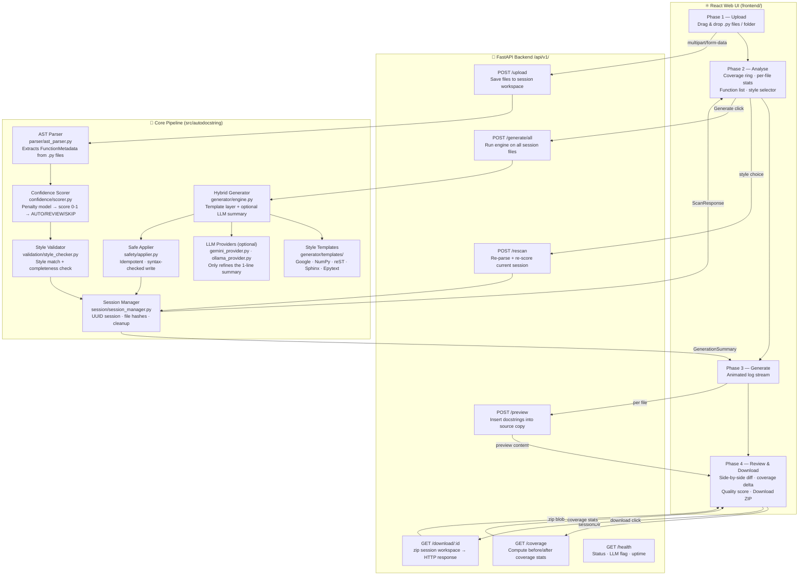

# Automated Python Docstring Generator

> **Internship Project — Infosys | Python Automation & AI-Assisted Developer Tooling**

A system that **automatically analyses, generates, and validates Python docstrings** using static code analysis (AST) with an optional LLM layer. It exposes a FastAPI REST backend and a React web UI — developers upload Python files, the system analyses coverage and generates complete docstrings, then lets them inspect a side-by-side diff and download the fully documented project as a ZIP.

---

## Table of Contents

1. [Problem Statement](#problem-statement)
2. [How It Works — User Workflow](#how-it-works--user-workflow)
3. [System Architecture](#system-architecture)
4. [Component Deep-Dive](#component-deep-dive)
5. [API Reference](#api-reference)
6. [Data Flow — End to End](#data-flow--end-to-end)
7. [Confidence Scoring Model](#confidence-scoring-model)
8. [Docstring Styles Supported](#docstring-styles-supported)
9. [Safety Guarantees](#safety-guarantees)
10. [Project Structure](#project-structure)
11. [How to Run](#how-to-run)
12. [Running Tests](#running-tests)
13. [Technology Stack](#technology-stack)

---

## Problem Statement

Python projects routinely ship functions and classes with **missing, incomplete, or inconsistently styled docstrings**. Manual documentation is slow, error-prone, and never kept in sync with the code. Existing linters only report the gaps — they cannot fix them.

This project solves the problem end-to-end:

- Parses Python source files statically (no code execution) and measures documentation coverage
- Scores every function by how confidently a docstring can be generated from its AST signature
- Generates complete, style-compliant docstrings using deterministic templates (and optionally an LLM)
- Shows developers a side-by-side before/after comparison inside a web UI
- Lets them download the fully documented project as a ZIP file

---

## How It Works — User Workflow

The entire experience runs through **four sequential phases** inside the web UI:

```
┌─────────────────────────────────────────────────────────────────────┐
│  PHASE 1 — UPLOAD                                                   │
│  Drag & drop .py files or an entire project folder onto the UI.     │
│  Files are uploaded to the FastAPI backend.                         │
└────────────────────┬────────────────────────────────────────────────┘
                     │  POST /api/v1/upload
                     ▼
┌─────────────────────────────────────────────────────────────────────┐
│  PHASE 2 — ANALYSE                                                  │
│  Backend parses every file with AST, scores each function, and      │
│  checks existing docstrings for style and completeness.             │
│  UI shows:  coverage % ring  ·  per-file breakdown  ·  function     │
│  list (documented / undocumented).  User picks a docstring style    │
│  (Google / NumPy / reST / Sphinx / Epytext) then clicks Generate.  │
└────────────────────┬────────────────────────────────────────────────┘
                     │  POST /api/v1/generate/all
                     ▼
┌─────────────────────────────────────────────────────────────────────┐
│  PHASE 3 — GENERATE                                                 │
│  Backend runs the hybrid docstring engine on every undocumented     │
│  function.  A live log stream plays in the UI while processing.     │
│  After generation, backend fetches file previews for all files.     │
└────────────────────┬────────────────────────────────────────────────┘
                     │  POST /api/v1/preview  (per file)
                     ▼
┌─────────────────────────────────────────────────────────────────────┐
│  PHASE 4 — REVIEW & DOWNLOAD                                        │
│  Side-by-side diff viewer shows original vs documented code.        │
│  Newly added docstrings are highlighted in green.                   │
│  Coverage banner shows  before → after  with delta badge.           │
│  Quality score (0-100) shown alongside warnings / errors.           │
│  User clicks  Download ZIP  to get the fully documented project.    │
└────────────────────┬────────────────────────────────────────────────┘
                     │  GET /api/v1/download/{session_id}
                     ▼
                  📦 documented_project_<id>.zip
```

---

## System Architecture



---

## Component Deep-Dive

### 1. AST Parser (`parser/`)

Reads `.py` files using Python's built-in `ast` module — **no code is ever executed**. The parser walks the AST tree and extracts a `FunctionMetadata` object for every function and method it finds.

| What is extracted | How |
|-------------------|-----|
| Function / method names | `ast.FunctionDef`, `ast.AsyncFunctionDef` |
| Parameters + type hints | `ast.arg`, `ast.annotation` |
| Return type annotation | `ast.returns` |
| Decorator types | `@property`, `@staticmethod`, `@classmethod` → mapped to `NodeType` enum |
| Existing docstring | First string literal in function body (`ast.Constant`) |
| Cyclomatic complexity | Count of `if`/`for`/`while`/`try`/`BoolOp` nodes — fed to scorer |
| Async flag | `isinstance(node, ast.AsyncFunctionDef)` |
| Line range | `node.lineno`, `node.end_lineno` |

**Key output type:** `FunctionMetadata` — consumed by the scorer, generator, and validator.

---

### 2. Confidence Scorer (`confidence/scorer.py`)

Fully **deterministic and offline** — never calls an LLM. Takes a `FunctionMetadata` and returns a `ScoringResult` (confidence, risk, reason).

**Penalty model — starts at 1.0:**

| Penalty condition | Deduction |
|-------------------|-----------|
| Each parameter missing a type hint | −0.05 per parameter |
| Missing return type annotation | −0.10 |
| Cyclomatic complexity > 8 branches | −0.10 |
| Generator function (`yield` present) | −0.05 |
| Call to non-whitelisted external module | −0.05 |

**Whitelisted modules** (not penalised): `builtins`, `typing`, `dataclasses`, `collections`, `math`, `os`, `sys`, `re`, `abc`, `functools`, `itertools`, `pathlib`, `enum`

**Decision thresholds:**

```
confidence ≥ 0.85  →  AUTO_APPLY   risk = LOW     generate automatically
0.60 ≤ conf < 0.85 →  REVIEW       risk = MEDIUM  generate, flag for attention
confidence < 0.60  →  SKIP         risk = HIGH    too uncertain, do not generate
```

The threshold constants (`AUTO_APPLY = 0.85`, `REVIEW = 0.60`) are used by both the backend engine and the `/api/v1/generate` route.

---

### 3. Hybrid Docstring Generator (`generator/`)

Two-layer system:

**Layer 1 — Deterministic Template Engine** (`engine.py`)

The `HybridDocstringEngine` calls `DocstringGenerator` which selects a style-specific template and renders a complete docstring from the `FunctionMetadata`. This always works offline, with zero external calls.

**Layer 2 — Optional LLM Refinement**

Only the **one-line summary sentence** is optionally passed to an LLM provider. The Args / Returns / Raises sections are always template-rendered. The LLM only polishes the opening sentence.

| Provider | How to activate |
|----------|----------------|
| `GeminiProvider` | Set `GEMINI_API_KEY` environment variable |
| `OllamaProvider` | Run Ollama locally; select "local" in UI |
| None (default) | No env var / no Ollama → fully offline |

After generation, a `DocstringValidator` auto-fixes minor formatting issues (missing period, spacing) before the result is stored in the session.

---

### 4. Style Validator (`validation/style_checker.py`)

Used during both the **scan** and **post-generation** phases. Checks two things per function:

1. **Style Match** — regex-based detection of section markers (e.g. `Args:` for Google, `----------` underlines for NumPy, `:param:` for reST). Returns `False` if the existing docstring uses a different format than what was requested.
2. **Completeness** — checks that every non-`self`/`cls` parameter name appears somewhere in the docstring. A function with a 1-line summary that omits parameters is marked as *incomplete*.

A function passes only if **both** checks return `True`. Otherwise it is flagged as needing documentation, even if it already has a docstring.

---

### 5. Session Manager (`session/session_manager.py`)

Each upload creates a **UUID-based session** persisted on disk under `.autodocstring_sessions/`:

| Stored in session | Purpose |
|-------------------|---------|
| `scan_results` | List of all functions + their current docstring status |
| `file_hashes` | SHA-256 of each file at scan time (conflict detection) |
| `docstring_style` | Style chosen by the user for this session |
| `workspace/` subdirectory | Copy of all uploaded files — the generator and applier work on this copy, never the originals |
| `current_batch_id` | UUID of the active generation batch (used for cancellation) |
| `is_cancelled` flag | Set by `POST /generate/cancel` to abort mid-batch |

A background async task runs every 30 minutes and deletes sessions older than the inactivity threshold.

---

### 6. Safe Applier (`safety/applier.py`)

Used by `/preview` and `/download` to insert generated docstrings into the source text. Provides these guarantees:

| Guarantee | How |
|-----------|-----|
| **Idempotency** | If the function already has the same docstring, the file is unchanged |
| **Syntax safety** | After every write, the file is re-parsed with `ast.parse`; on `SyntaxError` the original is restored |
| **Non-intrusive** | Only the docstring AST node is replaced; all other code, indentation, and comments are untouched |
| **Dry-run mode** | `dry_run=True` computes a unified diff without writing to disk |

---

## API Reference

All endpoints are prefixed `/api/v1/`. Deprecated root-level routes (`/scan`, `/generate`, etc.) return **410 Gone**.

| Method | Endpoint | Used by UI | Purpose |
|--------|----------|-----------|---------|
| `GET` | `/health` | — | Status, LLM availability, active sessions, uptime |
| `POST` | `/upload` | ✅ Phase 1 | Upload `.py` files; create session; return scan results |
| `POST` | `/scan` | — | Scan a local folder path by server-side path string |
| `POST` | `/rescan` | ✅ Phase 2 | Re-parse session files with a new docstring style |
| `POST` | `/generate` | — | Generate docstrings for one specific function |
| `POST` | `/generate/all` | ✅ Phase 3 | Generate docstrings for every file in the session |
| `POST` | `/generate/file` | — | Generate docstrings for one specific file |
| `POST` | `/generate/cancel` | — | Abort an in-progress bulk generation |
| `POST` | `/preview` | ✅ Phase 3→4 | Return the full file source with docstrings inserted (no disk write) |
| `GET` | `/file` | ✅ Phase 3→4 | Return original source of a session file |
| `GET` | `/coverage` | ✅ Phase 4 | Compute before/after documentation coverage percentages |
| `GET` | `/download/{id}` | ✅ Phase 4 | Build ZIP of all session files with docstrings → stream download |
| `POST` | `/save_file` | — | Write user-edited text directly to a session file |
| `POST` | `/review` | — | Record approve/reject decisions (backend-only, not wired to UI) |
| `POST` | `/apply` | — | Apply approved decisions to live files (backend-only, not wired to UI) |
| `POST` | `/undo` | — | Restore files from backup after an apply |
| `GET` | `/diff` | — | Return unified diff for approved decisions |
| `GET` | `/session/{id}` | — | Retrieve full session state |

---

## Data Flow — End to End

```
1. USER drops files onto the web UI
   → POST /api/v1/upload  { files: [...], style: "google" }

2. BACKEND — for each .py file:
   a. Save to  .autodocstring_sessions/<uuid>/workspace/
   b. ast_parser.parse(file)  →  FunctionMetadata list
   c. ConfidenceScorer.score(func)  →  confidence, risk, reason
   d. StyleValidator.is_style_match() + is_complete()  →  skipped flag
   → Return ScanResponse { session_id, functions[] }

3. UI shows Phase 2 (Analyse):
   - Coverage ring showing  documented / total
   - Per-file breakdown sorted by coverage (lowest first)
   - Full function list with status per function
   - Style selector  (Google / NumPy / reST / Sphinx / Epytext)
   - "Generate Docstrings" button

4. USER clicks Generate
   → POST /api/v1/generate/all { session_id, style, llm_provider }

5. BACKEND — HybridDocstringEngine.generate_for_module():
   a. Read file from session workspace
   b. For each undocumented function:
      - DocstringGenerator renders template  →  docstring string
      - (optional) LLM refines first sentence only
      - DocstringValidator auto-fixes formatting
   c. Merge results back into session.scan_results
   → Return GenerationSummary { total_generated, quality_score, warnings, errors }

6. UI fetches previews for every file
   → POST /api/v1/preview { session_id, file_path }  (one request per file)
   BACKEND:
   a. Load original source from workspace
   b. SafeApplier._insert_docstrings(source, results)  →  new_source (no disk write)
   c. Return new_source

7. UI computes coverage delta
   → GET /api/v1/coverage?path=<sessionDir>&session_id=<id>

8. UI enters Phase 4 (Review & Download):
   - Side-by-side comparison viewer (original vs documented)
   - New docstring blocks highlighted in green
   - Top bar: before% → after% · +delta · quality score · style badge
   - File navigator with per-file coverage indicators

9. USER clicks Download
   → GET /api/v1/download/<session_id>
   BACKEND:
   a. For each .py in workspace, inject all generated docstrings
   b. Write into a temp directory
   c. shutil.make_archive → .zip
   → Stream zip as HTTP response (browser auto-downloads)
```

---

## Confidence Scoring Model

```
Starting score = 1.0

Penalties applied per function:

  Each untyped parameter          × (−0.05)
  Missing return annotation         −0.10
  Cyclomatic complexity > 8         −0.10
  Generator function (yield)        −0.05
  External non-whitelisted call     −0.05

Final score clamped to [0.0, 1.0]

Decision:
  score ≥ 0.85  →  AUTO_APPLY   ✅  Generated automatically
  score ≥ 0.60  →  REVIEW       ⚠️  Generated, flagged in quality report
  score  < 0.60  →  SKIP        ❌  Not generated (too uncertain)
```

Risk levels are also used to colour-code functions in the UI and in the quality score calculation returned by `/generate/all`.

---

## Docstring Styles Supported

| Style | Detectable markers | Example header |
|-------|--------------------|----------------|
| **Google** | `Args:`, `Returns:`, `Raises:`, `Yields:` | `Args:` |
| **NumPy** | Section + `---` underline: `Parameters\n----------` | `Parameters\n----------` |
| **reStructuredText** | `:param name:`, `:returns:`, `:rtype:` | `:param x: Description` |
| **Sphinx** | Same as reST (treated identically) | `:param x: Description` |
| **Epytext** | `@param name:`, `@return:`, `@rtype:` | `@param x: Description` |

The style is selected once per session in the Analyse phase and applied consistently to every generated docstring. The validator uses the same markers to detect **mismatches** in existing docstrings.

---

## Safety Guarantees

The system never corrupts source files. Safety layers from outer to inner:

1. **Session workspace isolation** — uploaded files are copied to a private session directory; originals are never touched
2. **Path sandboxing** — `/scan` and `/file` enforce `path.relative_to(PROJECT_ROOT)`; anything outside returns 403
3. **Per-file async locks** — concurrent generate/save requests on the same file are serialised
4. **Idempotent writes** — applying the same docstring twice produces identical output
5. **Post-write syntax check** — every `ast.parse()` after write; instant rollback on `SyntaxError`
6. **Dry-run / preview** — `/preview` inserts docstrings into an in-memory string only, never writes to disk
7. **Crash recovery** — on startup, `recover_orphan_backups()` restores any interrupted transactions from the previous run

---

## Project Structure

```
Automated-Python-Docstring-Generator/
│
├── src/autodocstring/              # Python backend package
│   ├── api/
│   │   ├── app.py                  # FastAPI app + all route handlers (1100 lines)
│   │   └── schemas.py              # Pydantic request / response models
│   ├── parser/
│   │   ├── ast_parser.py           # SourceCodeParser — walks AST, builds ModuleMetadata
│   │   └── extractors.py           # FunctionExtractor, ClassExtractor
│   ├── models/
│   │   └── metadata.py             # FunctionMetadata, ClassMetadata, DocstringResult, RiskLevel
│   ├── confidence/
│   │   └── scorer.py               # ConfidenceScorer — penalty model, ScoringResult
│   ├── generator/
│   │   ├── engine.py               # DocstringGenerator + HybridDocstringEngine
│   │   ├── gemini_provider.py      # Google Gemini API integration
│   │   ├── ollama_provider.py      # Local Ollama integration
│   │   └── templates/              # Google, NumPy, reST, Sphinx, Epytext templates
│   ├── validation/
│   │   ├── style_checker.py        # is_style_match() · is_complete()
│   │   └── validator.py            # DocstringValidator — auto-fixes formatting
│   ├── safety/
│   │   ├── applier.py              # SafeApplier — _insert_docstrings(), dry-run, rollback
│   │   ├── transaction.py          # run_atomic_apply(), crash recovery
│   │   └── git_diff.py             # Unified diff generation
│   ├── session/
│   │   └── session_manager.py      # Session CRUD, file hashes, background cleanup
│   ├── config/
│   │   └── loader.py               # pyproject.toml → config dict
│   ├── utils/
│   │   └── files.py                # find_python_files(), glob helpers
│   └── integrations/
│       └── precommit.py            # Pre-commit hook entry point
│
├── frontend/                        # React 18 + TypeScript web UI
│   └── src/
│       ├── App.tsx                 # Root component + ErrorBoundary
│       ├── apiClient.ts            # Typed fetch wrapper for all API calls
│       ├── store/sessionStore.ts   # Zustand global state (phase, session, files, report)
│       └── components/
│           ├── WorkflowPage.tsx    # Phase orchestrator — drives all 4 phases
│           ├── UploadPhase.tsx     # Drag-and-drop file upload with folder traversal
│           ├── AnalyzePhase.tsx    # Coverage ring, per-file table, function list, style picker
│           ├── GeneratePhase.tsx   # Animated log stream during generation
│           ├── ReviewPhase.tsx     # Side-by-side diff · coverage stats · Download button
│           ├── ComparisonViewer.tsx# Original vs documented code viewer with highlights
│           ├── FunctionNavigator.tsx # File list with per-file coverage indicators
│           ├── CoverageReport.tsx  # Coverage breakdown table
│           ├── PhaseHeader.tsx     # Step indicators top bar
│           └── ...                 # Supporting components
│
├── tests/                          # Pytest test suite
│   ├── test_api.py                 # REST endpoint + session lifecycle (80+ assertions)
│   ├── test_parser.py              # AST parsing accuracy
│   ├── test_generator.py           # All 5 docstring styles
│   ├── test_confidence.py          # Scoring penalties + thresholds
│   ├── test_safety.py              # Idempotency, dry-run, rollback
│   ├── test_validation.py          # Style detection, completeness
│   ├── conftest.py                 # Shared pytest fixtures
│   └── sample_project/             # Real Python project used as test input
│       ├── calc.py · math_utils.py · string_utils.py · syntax_error.py
│       ├── api/ · async_ops/ · core/ · data/ · decorators/ · legacy/ · utils/
│       └── hard_cases/             # Edge cases: style mismatch, tricky strings, syntax errors
│
├── demo/                           # Live demo files (3 scenario files)
│   ├── calculator.py               # Scenario A: 0 % coverage — no docstrings
│   ├── user_service.py             # Scenario B: partial — summaries only, no Args/Returns
│   ├── utils.py                    # Scenario C: style mismatch — NumPy docs in Google project
│   └── README.md                   # Step-by-step live demo script
│
├── docs/                           # Project documentation
│   ├── PROJECT_EXPLANATION.md      # Full technical documentation (this file)
│   └── TESTING_GUIDE.md            # Test writing and execution guide
│
├── pyproject.toml                  # Package metadata, pytest config, black config
├── setup.py                        # Fallback setup for older pip
└── README.md                       # Quick-start guide
```

---

## How to Run

### Prerequisites

- Python 3.8 or higher
- Node.js 18 or higher

### 1. Backend

```bash
# Install Python dependencies
pip install -e ".[dev]"

# Start the FastAPI server (hot-reload enabled)
python -m uvicorn autodocstring.api.app:app --reload --port 8001 --app-dir src
```

- API: `http://localhost:8001`
- Swagger docs: `http://localhost:8001/docs`

### 2. Frontend

```bash
cd project/frontend
npm install
npm run dev
```

- Web UI: `http://localhost:5173`

> **Note:** The frontend `apiClient.ts` points to `http://localhost:8001/api/v1`. If you change the backend port, update `API_BASE` in [project/frontend/src/apiClient.ts](project/frontend/src/apiClient.ts).

---

## Running Tests

```bash
# Full suite with terminal coverage report
pytest

# Single module
pytest tests/test_parser.py -v

# HTML coverage report
pytest --cov=src/autodocstring --cov-report=html
```

| Test Module | What is verified |
|------------|-----------------|
| `test_parser.py` | Functions, classes, async, `@property`/`@staticmethod`/`@classmethod`, decorators, dataclasses, syntax errors |
| `test_generator.py` | All 5 docstring styles, methods, generators, no-return, no-param functions |
| `test_confidence.py` | Every penalty factor, risk level assignment, threshold boundary conditions |
| `test_safety.py` | Idempotency guarantee, dry-run diff output, syntax rollback, ignore directives |
| `test_validation.py` | Style detection for all formats, completeness with edge-case parameter names |
| `test_api.py` | All REST routes, session lifecycle, 409 conflict, 403 sandbox escape, health fields, 410 deprecated routes |

---

## Technology Stack

| Layer | Technology | Role |
|-------|-----------|------|
| Backend language | Python 3.8+ | Core logic, AST analysis, generation pipeline |
| REST API | FastAPI + Uvicorn | Async HTTP server; Swagger UI auto-generated |
| Data validation | Pydantic v2 | Request/response schema enforcement |
| Templating | Jinja2 | Style-specific docstring template rendering |
| Frontend | React 18 + TypeScript | Interactive single-page web UI |
| State management | Zustand | Lightweight global state (phases, session, files) |
| Build tool | Vite | Dev server + production bundle |
| LLM (optional) | Google Gemini / Ollama | Refines the one-line summary sentence only |
| Testing | Pytest + pytest-cov | Unit and integration test suite |
| Code style | Black + Flake8 | Formatting and linting |
| Packaging | setuptools / pyproject.toml | Python package distribution |
